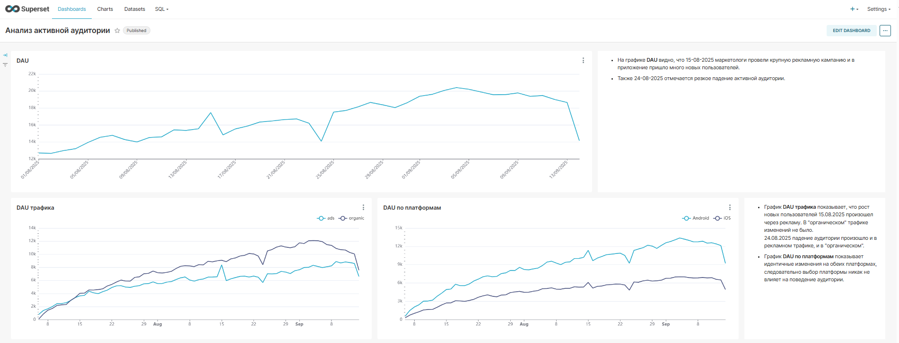
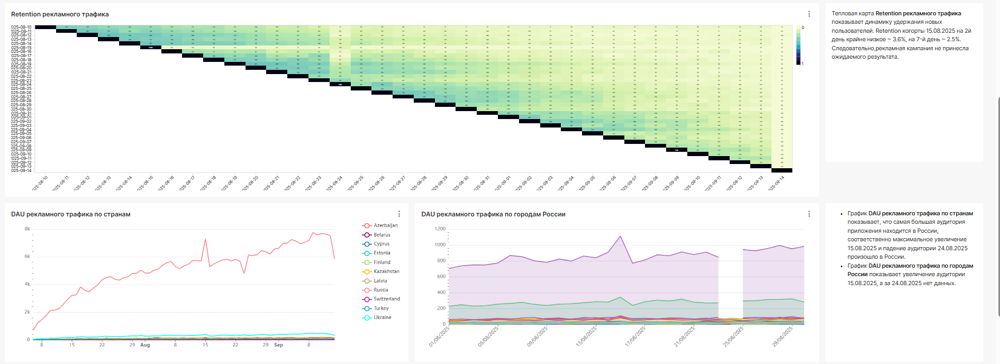
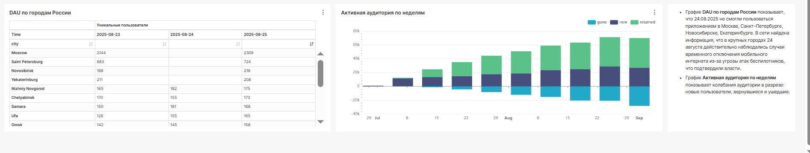

### "Анализ продуктовых метрик мобильного приложения"   

**Стек:** Superset, ClickHouse, Pandahouse.  

**Описание задачи:**  
В приложении за последние несколько дней произошло два значительных события:  
1. маркетологи провели крупную рекламную кампанию, и в приложение пришло много новых пользователей.
2. в один из дней резко упала аудитория.

**Необходимо сделать:**  
1. проанализировать характер Retention пользователей, привлечённых рекламной кампанией (что стало с рекламными пользователями в дальнейшем, как часто они продолжают пользоваться приложением);
2. выяснить, какие пользователи не смогли воспользоваться лентой и что их объединяет;
3. разработать дашборд с визуализацией результатов работы.

**Этапы работы:**
Подключение к БД, построение графиков с использованием новых полей, верстка дашборда.  

**Результат:**  
- найдены дни, когда произошли 2 значительных события: 15.08.2025 - рост новых пользователей, 24.08.2025 - падение аудитории;  
- рост новых пользователей 15.08.2025 произошел через рекламу, в "органическом" трафике изменений не было, 24.08.2025 падение аудитории произошло и в рекламном трафике, и в "органическом";
- идентичные изменения DAU на обеих платформах, следовательно выбор платформы никак не влияет на поведение аудитории;
- Retention когорты 15.08.2025 на 2й день крайне низкое ~ 3.6%, на 7-й день ~ 2.5%. Следовательно, рекламная кампания не принесла ожидаемого результата;
- самая большая аудитория приложения находится в России, соответственно максимальное увеличение 15.08.2025 и падение аудитории 24.08.2025 произошло в России;
- 24.08.2025 не смогли пользоваться приложением в Москве, Санкт-Петербурге, Новосибирске, Екатеринбурге. В сети найдена информация, что в крупных городах России 24 августа действительно наблюдались случаи временного отключения мобильного интернета;
- дополнительно создан график "Активная аудитория по неделям" для анализа колебаний аудитории в разрезе: новые пользователи, вернувшиеся и ушедшие.
- создан дашборд в Superset, который визуализирует результат анализа продуктовых метрик мобильного приложения.

Расчет метрик можно посмотреть в файле **[Расчет метрик для дашборда](Расчет_метрик_для_дашборда.ipynb)**   

